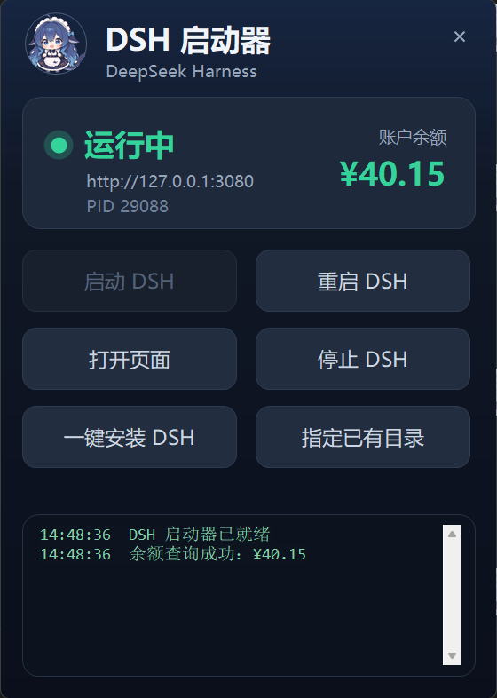
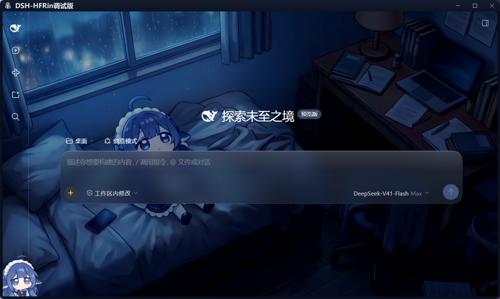

# DSH 启动器

[](LICENSE)
[](../../releases/latest)
[](#环境要求)
[](#环境要求)

Windows 上的 [DeepSeek Harness](https://github.com/deepseek-ai/deepseek-harness) 启动器：**一块面板管启停与日志，一个内嵌窗口看界面 —— 不再往浏览器里塞标签页。**

**[⬇ 下载最新成品包](../../releases/latest)** —— 解压即用，不用编译、不用改任何配置。

<p align="center">
  
  
</p>

---

## 它解决什么问题

- 原生 `dsh web` 每次都弹浏览器，DSH 混在几十个标签页里找不着
- 命令行启停麻烦，看不到实时日志和账户余额
- 关掉终端/启动器窗口会把 DSH 一起带走（stdout 管道断开 → EPIPE → 进程崩溃）
- 高 DPI 屏上界面发虚、窗口标题栏是系统白条，跟深色界面割裂

## 功能

### 面板窗口

- 一键 **启动 / 重启 / 停止** DSH
- **自动找 DSH**：路径不写死，可识别任意位置的安装；找不到时支持一键安装或手动指定
- 实时状态：监听地址、PID、账户余额（60 秒自动刷新）
- **运行日志**：DSH 的 stdout/stderr 实时回显到面板
- 系统托盘式的精简尺寸，DPI 感知（PerMonitorV2）

### 运行窗口（独立窗口，不是浏览器）

- **WebView2 内核**，没有地址栏、标签栏、书签栏
- **自动带 token**：从 `$DSH_HOME/logs/dsh-web.out.log` 解析当前 token，避免根路径 401
- **`--no-proxy-server`**：系统开着代理时也能正常访问 `127.0.0.1`
- **自绘边框**：圆角、渐变描边（左上受光）、鲸鱼头像 + 标题的深色标题栏、三个自绘按钮
- **最大化自动收细边框**（8px → 3px），窗口矩形精确贴合工作区，不压任务栏
- **原生窗口动画**：打开 / 关闭 / 最小化 / 还原由 DWM 播放（缩放淡入、飞向任务栏）
- 拖动标题栏移动，**拖到屏幕边缘可分屏**；双击标题栏最大化 / 还原
- `F12` 开发者工具、右键菜单、`Ctrl+R` 刷新
- 页面里的外链（`target=_blank`）交给系统默认浏览器

### 两者关系

面板和运行窗口是**同一个 exe 的两个窗口**，各自独立关闭：

- 关掉面板 → 运行窗口继续开着，进程不退
- 两个都关掉 → 进程才退出
- 面板与页面窗口用自定义 `ApplicationContext` 管理生命周期
- 同一时间只允许一个实例（两个窗口共用同一份 WebView2 数据目录，而它是独占的）：
  重复双击会把已有窗口叫到前台；万一已有实例连窗口都没有了，会问一句是否结束它再重新
  打开 —— 只结束启动器本身，不碰正在跑的 DSH

## 环境要求

| 依赖 | 说明 |
|---|---|
| Windows 10 / 11 x64 | 开发和验证环境是 Windows 11 |
| .NET Framework 4.8 | Win10 1803+ 自带 |
| WebView2 Runtime | Win11 随 Edge 自带；Win10 可能需[单独安装](https://developer.microsoft.com/microsoft-edge/webview2/) |
| DeepSeek Harness | 已安装的 `@deepseek-ai/dsh`（Node 运行时 + 主程序）|

## 下载

| 方式 | 说明 |
|---|---|
| **成品包（推荐）** | 到 [Releases](../../releases/latest) 下载 `DSH启动器-成品-*.zip`，解压到任意目录，双击 exe 就能用 —— 启动器会自己找到 DSH |
| **自己编译** | 见下方[「快速开始 → 自己编译」](#自己编译)，只需要 .NET Framework 自带的 `csc.exe`，不用装 .NET SDK |

> 仓库里的 `release/`、`build/` 是本地构建目录，**没有纳入版本库**（见 [.gitignore](.gitignore)）。
> `dist/` 是成品目录，内容与成品包一致：

| 文件 | 说明 |
|---|---|
| `dist\DSH启动器.exe` | 主程序 |
| `dist\Microsoft.Web.WebView2.*.dll` | WebView2 托管库（运行必需）|
| `dist\WebView2Loader.dll` | 原生加载器（运行必需）|

改了源码要重新编译，**双击 `一键编译并部署.bat`** 即可（编译 → 自动检测 DSH 安装位置 → 部署 → 冒烟验证 → 同步 dist）。

## 快速开始

### 直接用编译好的

1. 取 `DSH启动器.exe` 和这三个文件放在同一目录：

   ```
   DSH启动器.exe
   Microsoft.Web.WebView2.Core.dll
   Microsoft.Web.WebView2.WinForms.dll
   WebView2Loader.dll
   ```

2. 双击运行 —— **不用改任何源码**，启动器会自己找到 DSH

   没找到时，面板上有两个按钮兜底：

   | 按钮 | 作用 |
   |---|---|
   | **一键安装 DSH** | 选一个目录，自动下载 Node 运行时并 `npm install @deepseek-ai/dsh` |
   | **指定已有目录** | 已经装好但没被检测到？手动选中 DSH 根目录，路径会被记住 |

### 自己编译

```powershell
# 在源码目录执行（需要 .NET Framework 自带的 csc.exe）
powershell -ExecutionPolicy Bypass -File build.ps1
```

`build.ps1` 会：编译到 `build\` → **自动检测 DSH 安装位置** → 部署 exe 与三个运行库 → 起一个实例检查最大化是否贴合工作区并截图留证。

可选参数：`-NoDeploy`（只编译）、`-DeployTo <目录>`（指定部署位置）、`-NoSmoke`（跳过冒烟）。

## 自动检测 DSH

启动时按优先级探测，**第一个同时具备 `node\node.exe` 与 `dsh\node_modules\@deepseek-ai\dsh\lib\bin.js` 的目录**胜出：

| 顺序 | 来源 |
|---|---|
| 1 | `launcher-path.txt`（exe 同目录，手动指定后写入） |
| 2 | 环境变量 `DSH_ROOT` |
| 3 | 环境变量 `DSH_HOME` 及其上级目录 |
| 4 | **exe 自身所在目录，以及向上 4 级** |
| 5 | 常见位置：`%LOCALAPPDATA%`、`%USERPROFILE%`、`%ProgramFiles%`、`C:`~`G:` 根下的 `DeepSeekHarness` / `DSH` |
| 6 | 当前工作目录 |

所以 exe 放在 DSH 根目录、或者它的任意子目录里都能认出来。想确认探测过程：

```powershell
DSH启动器.exe --where
```

逐条打印候选目录的判定结果，并落一份 `launcher-where.txt` 留档。

**DSH_HOME** 的确定顺序：环境变量 `DSH_HOME` → `<root>\home` → `%USERPROFILE%\.dsh`。
**端口**固定 3080，写在 `Cfg.Port`。

## 安装 / 部署 DSH

两种方式，装出来的东西一样（Node 运行时 + `@deepseek-ai/dsh`）：

**图形界面**：面板上点「一键安装 DSH」，选个目录即可。

**命令行**（适合脚本化 / 无人值守）：

```powershell
DSH启动器.exe --install "D:\DeepSeekHarness"
```

进度逐行写 `launcher-install.log`（exe 同目录）。流程：

1. 查最新 Node LTS 版本（`npmmirror.com/mirrors/node/index.json`），查不到就用内置的兜底版本
2. 下载 `node-vX-win-x64.zip`，解压时剥掉公共顶层目录
3. 用 `node\npm.cmd` 安装 `@deepseek-ai/dsh`（走 `registry.npmmirror.com`）
4. 建 `home\`，把路径写进 `launcher-path.txt`

目标目录里已有 Node 运行时则跳过第 2 步；整个目录已经是可用安装则直接切换过去，不重复下载。

## 命令行参数

| 参数 | 行为 |
|---|---|
| 无 | 打开启动器面板 |
| `--page` | 只打开运行窗口，不显示面板（适合做"直接进界面"的快捷方式）|
| `--where` | 只报告 DSH 位置的检测结果并退出，不弹任何窗口（同时写 `launcher-where.txt`）|
| `--install <目录>` | 无界面安装 DSH 到指定目录（下载 Node 运行时 + `npm install @deepseek-ai/dsh`），日志写 `launcher-install.log` |

## 目录结构

```
仓库根目录
├─ Launcher3.cs                 启动器主体（面板 + 运行窗口 + 自绘边框 + 定位/安装）
├─ build.ps1                    编译 + 自动定位 + 部署 + 冒烟 + 同步 dist
├─ 一键编译并部署.bat           双击即跑 build.ps1（全流程）
├─ app.manifest                 DPI 感知 / 通用控件 v6 / Win10-11 兼容
├─ app.ico                      程序图标
├─ logo160.png                  标题栏头像（编译为嵌入资源 WhaleIcon）
├─ whale64.png                  备用素材
├─ README.md                    本文件
├─ README-源码说明.txt          实现备注与踩坑记录
├─ CHANGELOG.md                 更新记录
├─ CONTRIBUTING.md              怎么提 Issue / PR、编译方式、编码约定
├─ SECURITY.md                  安全问题怎么私下报告
├─ LICENSE                      MIT
├─ .gitattributes               换行符与二进制处理规则
├─ .github/                     Issue 表单、PR 模板、CI（编译验证）
├─ lib/                         WebView2 SDK（编译引用，运行也需要）
├─ docs/                        README 配图
└─ dist/                        发布成品（exe + 3 个运行库），解压即用

不纳入版本库（.gitignore）
├─ build/                       编译中间产物，可随时删
└─ release/                     本地打包出来的 zip（正式分发走 Releases）
```

## 实现要点

都是踩过的坑，改代码前建议看一眼 [README-源码说明.txt](README-源码说明.txt)：

- **管道 EPIPE**：DSH 的 stdout/stderr 必须重定向到文件，不能接启动器进程的匿名管道，否则关掉启动器时管道读端断开，DSH 写日志直接崩
- **token 401**：DSH 根路径不带 token 会 401，所以运行窗口启动时从日志里解析当前 token
- **系统代理**：WebView2 默认走系统代理，本地回环也被拦，需要 `--no-proxy-server`
- **原生动画**：`FormBorderStyle.None` 的窗口没有 `WS_CAPTION`，Windows 不给播过渡动画 —— 保留 `Sizable` 样式再用 `WM_NCCALCSIZE` 抹掉非客户区
- **最大化留缝**：带边框窗口被系统最大化时窗口矩形比工作区大一圈，底部压任务栏 → 自定义最大化并在 `Resize` 里自动纠正
- **DPI 发虚**：进程声明 PerMonitorV2，窗口尺寸按显示器缩放换算
- **「窗口关没关」不能用 `IsDisposed` 判断**：`FormClosed` 是在 `Dispose()` **之前**触发的，
  那一刻 `IsDisposed` 还是 `false`。用它判断会让 `ApplicationContext` 一直以为窗口还开着、
  永远不调 `ExitThread()`，进程就变成一个没有窗口却还占着单实例锁的僵尸（外部表现：任务栏
  里什么都没有、再双击只提示「已经在运行了」，从此进不去）。统一用 `LauncherForm.IsGone`
- **未处理异常绝不弹模态框**：WinForms 自带的「未处理异常」对话框有嵌套消息循环，会把
  `ExitThread()` 投递的 `WM_QUIT` 吃掉，外层消息循环永远退不出来。统一写 `launcher-error.log`

## 已知限制

- 仅 Windows（依赖 WinForms + WebView2 + DWM）
- 运行窗口不支持透明度动画：WebView2 在分层窗口（`Opacity<1`）下渲染异常，所以只有面板用了淡入淡出
- 余额显示依赖 DSH 的凭据配置（`$DSH_HOME/.credentials.yaml`）

## 第三方组件

- [Microsoft.Web.WebView2](https://www.nuget.org/packages/Microsoft.Web.WebView2) 1.0.4258.31（NuGet 包中的 `lib/net462` 与 `runtimes/win-x64/native`），版权归 Microsoft，遵循其许可条款
- DeepSeek Harness 由 [deepseek-ai](https://github.com/deepseek-ai/deepseek-harness) 开发，本项目只是它的 Windows 外壳

## 更新记录

见 [CHANGELOG.md](CHANGELOG.md)。

## 参与贡献

见 [CONTRIBUTING.md](CONTRIBUTING.md)。简单说：

- 遇到问题 → 走 [Issues](../../issues/new/choose) 里的表单，按提示填就行
- 安全漏洞 → 别开公开 Issue，见 [SECURITY.md](SECURITY.md)
- 想改代码 → 直接提 PR；改完跑一次 `build.ps1 -NoDeploy -NoSmoke` 确认能编译

## License

[MIT](LICENSE) © 2026 HF-MTF and HFRin
